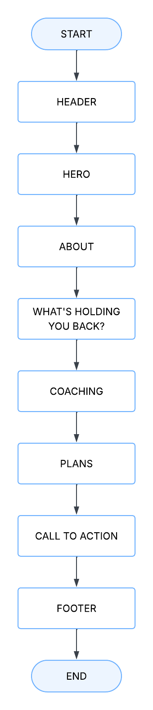
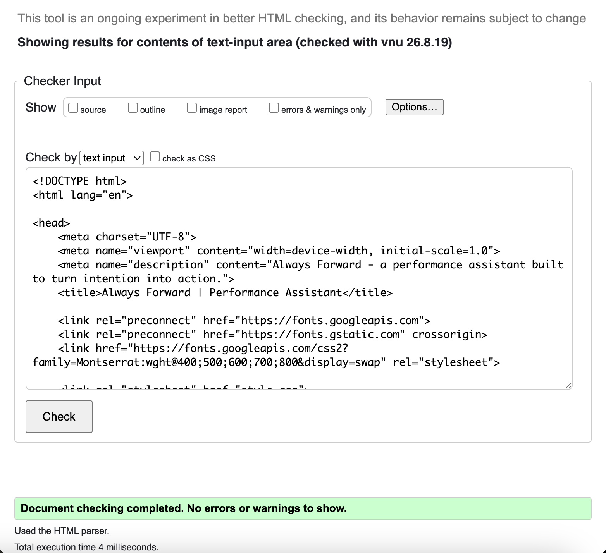
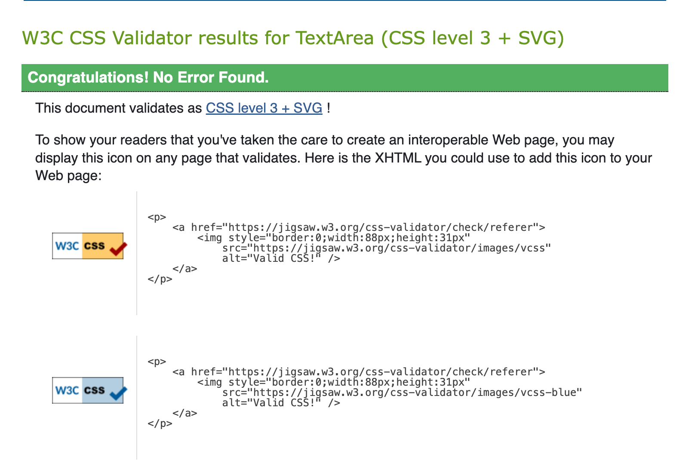

# Always Forward
Always Forward is a one-page fitness performance website designed to encourage users to build discipline, create better habits and keep moving forward after setbacks.

## Live Site
[View Always Forward](LIVE-LINK-HERE)

## UX

### User Stories
- As a user, I want to understand the purpose of the website quickly.
- As a user, I want to navigate easily between sections.
- As a user, I want to learn about the fitness and coaching support available.
- As a user, I want to view the website easily on desktop, tablet and mobile.

### Strategy and Scope
The aim is to introduce a fitness platform focused on training, discipline, habits and purpose.

This version is a one-page front-end website. More advanced tools are planned as future features.

### Structure
The website uses a simple one-page structure with navigation, hero, information, coaching, plans, call to action and footer.

### Skeleton
A briefly detailed wireframe was created using Lucidchart.

## Design

### Typography
Montserrat from Google Fonts is used throughout the website for a clean and modern look, with an alternate of san-serif.

### Colour Scheme
- Beige `#EDE5D8`
- Cream `#F7F2EA`
- Burgundy `#7A263A`
- Tan `#9A735B`
- Charcoal `#252220`

The lighter neutral colours create a modern look, while the darker fitness photography keeps the strong performance aesthetic.

### Imagery
Dark fitness images were used to contrast with the lighter colour scheme and support the fitness theme.
Alt text was added for the second image incase it doesn't display. No alt text for the hero image as it is a separate background, the text above would still be visible if it does not display. 

## Features
- Internal navigation
- Hero section
- Fitness and mindset cards
- Coaching section
- Plans section
- Hover effects
- Responsive layout

## Responsive Design
A CSS media query at `768px` adapts the layout for tablet and mobile screens.

## Future Features
- 24/7 AI Performance Assistant – An AI-powered chat assistant providing users with support, guidance and motivation at any time.
- Community Challenges – An anonymous community feature where users can compete through weekly goals such as completed workouts, calorie and macro targets, and overall consistency.
- More Interactive Features – Additional interactive elements to make the platform more engaging and encourage users to stay consistent.
- Contact and Registration Form – A fillable form where users can submit their details and interests so the Always Forward team can contact them about joining or receiving further support.
- Expanded Visual Design – Additional fitness imagery and visual content to make the website feel more modern, engaging and representative of the Always Forward concept.

## Technologies Used
- Lucidchart - wireframe
- HTML5 - website structure
- CSS3 - styling and responsive design
- VS Code - development
- Git and GitHub - version control and repository hosting
- Live Preview - local testing
- Google Fonts - Montserrat fonts

## Testing
The website was manually tested to make sure the main features work correctly.
Checks included:
- navigation links
- images loading correctly
- keyboard navigation
- heading structure
- alt text
- desktop, tablet and mobile layouts

### Validation

#### HTML
The HTML was tested using the W3C Markup Validator and returned no errors or warnings.

#### CSS
The CSS was tested using the W3C CSS Validator and returned no errors.

## Deployment
The website was deployed using GitHub Pages.
Steps:
1. Open the GitHub repository.
2. Go to Settings > Pages.
3. Select Deploy from a branch.
4. Select `master` and `/root`.
5. Save and open the generated live link.

## Credits

### Images
  - Hero image - 'Mohamed Fareed', Unsplash
  - Coaching image - 'Sushil Ghimire', Unsplash

### Other Resources
- Montserrat font - Google Fonts
- Wireframe - Lucidchart
- W3C HTML and CSS Validators
- Code Institute learning resources

## AI Use
AI was used to support project planning, code suggestions, explanations, troubleshooting and content development.

AI suggestions were reviewed, adapted and tested before being used in the final project.